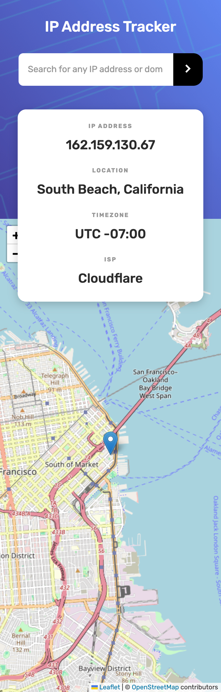

# Frontend Mentor - IP address tracker solution

This is a solution to the [IP address tracker challenge on Frontend Mentor](https://www.frontendmentor.io/challenges/ip-address-tracker-I8-0yYAH0). Frontend Mentor challenges help you improve your coding skills by building realistic projects. 

## Table of contents

  - [Overview](#overview)
  - [The challenge](#the-challenge)
  - [Screenshot](#screenshot)
  - [Links](#links)
  - [My process](#my-process)
  - [Built with](#built-with)
  - [Useful resources](#useful-resources)
  - [Author](#author)

## Overview

### The challenge

Users should be able to:

- View the optimal layout for each page depending on their device's screen size
- See hover states for all interactive elements on the page
- See their own IP address on the map on the initial page load
- Search for any IP addresses or domains and see the key information and location

### Screenshot

#### Desktop

.png)

#### Mobile

### Links

- Live Site URL: [Add live site URL here](https://your-live-site-url.com)

## My process

### Built with

- HTML
- Flexbox
- CSS
- Media query
- [React](https://reactjs.org/) - JS library

### Useful resources

- [IP Geolocation API by IPify](https://geo.ipify.org/) - I used this website to fetch the Ip address and domain name info.
- [LeafletJS](https://leafletjs.com/) - I used this website to fetch the map which displays the IP Address or domain name location.

## Author

- Website - [Aaron Young]()
- Frontend Mentor - [@MrYoung6](https://www.frontendmentor.io/profile/MrYoung6)

